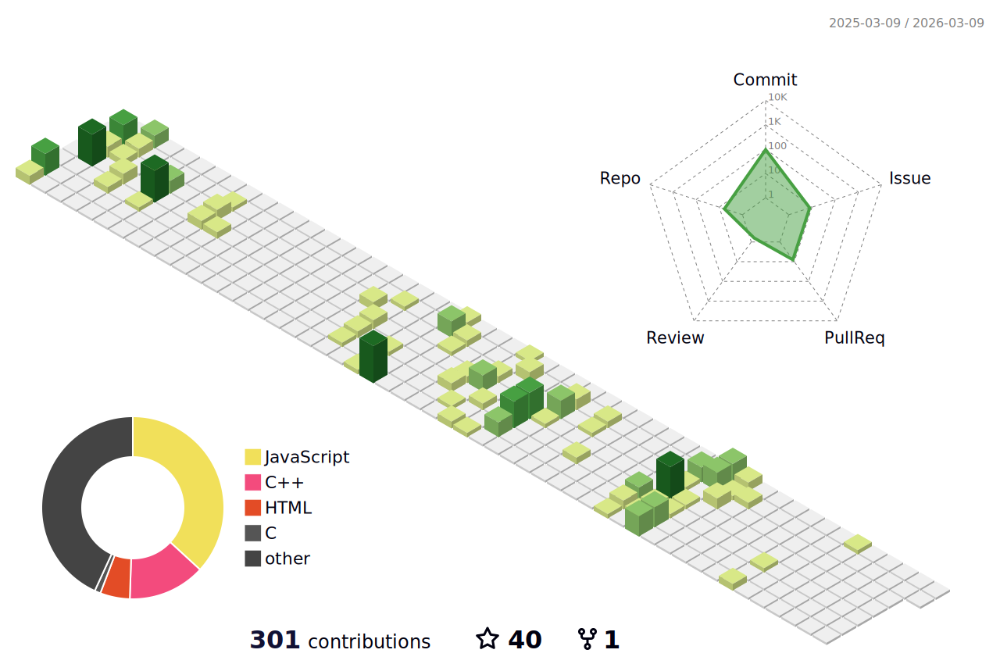

I am a driven tech explorer passionate about continuous learning and skill mastery, especially in Data Structures and Algorithms to solve complex problems. I enjoy coding, debugging, and optimizing solutions while focusing on creating intuitive and visually appealing tech designs. Always eager for new challenges, I am currently expanding my knowledge in cybersecurity and delving into Spring Boot development to broaden my expertise.
### - 📫 Email: **aggarwalpriyam08@gmail.com**
### - ⚡ Fun fact: **I think I am Creative 😁.**

    

<h2 >⚒️ Languages-Frameworks-Tools ⚒️</h2>
 

 

##  Github Stats :  

### Github 3D Contributions
<picture>
  <source media="(prefers-color-scheme: dark)" srcset="profile-3d-contrib/profile-night-green.svg" />
  <source media="(prefers-color-scheme: light)" srcset="profile-3d-contrib/profile-green-animate.svg" />
  
</picture>

<table>
  <tr>
    <td colspan="2" align="center">
      
    </td>
  </tr>
  <tr>
    <td align="center">
      ### Top Languages
       
      
    </td>
    <td align="center">
      ### Github Stats
       
      
    </td>
  </tr>
  <tr>
    <td colspan="2" align="center">
      ### Activity Contributions Graph
       
      
    </td>
  </tr>
</table>

<picture>
  <source media="(prefers-color-scheme: dark)" srcset="https://raw.githubusercontent.com/priyamaggarwal18/priyamaggarwal18/output/github-snake-dark.svg" />
  <source media="(prefers-color-scheme: light)" srcset="https://raw.githubusercontent.com/priyamaggarwal18/priyamaggarwal18/output/github-snake.svg" />
  
</picture>

<h2 >💫 My Badges 💫</h2>

<h2 >🤝 Connect with me 🤝</h2>
 
&nbsp&nbsp;
  

   

