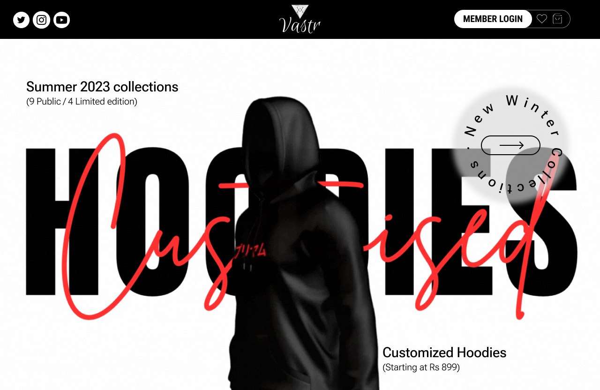

In my third year, my passion for tech design and coding continues to grow. Coding is an art that allows for creative expression and constant refinement of skills. I'm currently focused on full stack development with the MERN stack, which helps in building dynamic web applications. Additionally, I'm enhancing my problem-solving abilities through data structures and algorithms using C++, sharpening my analytical thinking. This dynamic journey turns challenges into opportunities for learning and growth in the ever-evolving tech landscape.

### - 📫 How to reach me: **priyamagggarwal@gmail.com**
### - ⚡ Fun fact: **I think I am Creative 😁.**
    

<h2 >🤝 Connect with me 🤝</h2>
 

   

<h2 >⚒️ Languages-Frameworks-Tools ⚒️</h2>
 

    

##  Github Stats :  

  

 

    
  
  
   

<h2 >💫 My Badges 💫</h2>

 

<h2>🨠My Figma Journey ğŸ¨</h2>

 

  
  

  
  
 

[↑ Back to Top ↑](#top)

