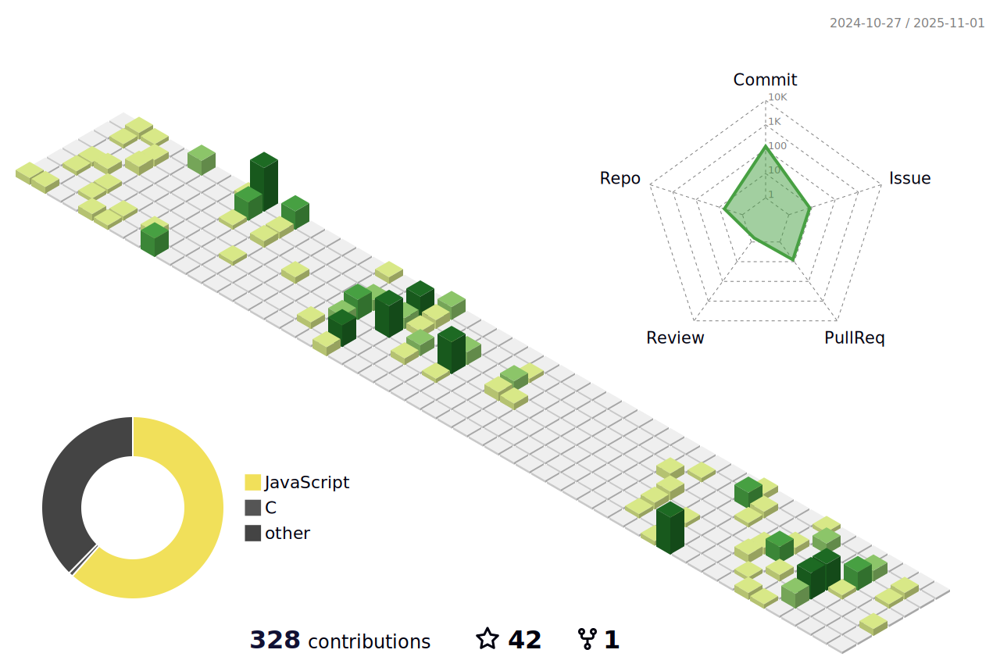

Driven tech explorer passionate about leveraging technology for impactful innovation. My focus is on continuous learning and skill mastery within the ever-evolving tech sphere. I'm currently strengthening my abilities in Data Structures and Algorithms to tackle complex challenges and build effective applications. I find immense satisfaction in coding, debugging, and optimizing solutions, and my enthusiasm extends to tech design for intuitive and visually appealing experiences. Always up for a new challenge, I'm also delving deeper into cybersecurity and currently exploring Spring Boot.
### - 📫 Email: **priyamagggarwal@gmail.com**
### - ⚡ Fun fact: **I think I am Creative 😁.**

    

<h2 >🤝 Connect with me 🤝</h2>
 
&nbsp&nbsp;
  

   

<h2 >⚒️ Languages-Frameworks-Tools ⚒️</h2>
 

 

##  Github Stats :  
<picture>
  <source media="(prefers-color-scheme: dark)" srcset="profile-3d-contrib/profile-night-green.svg" />
  <source media="(prefers-color-scheme: light)" srcset="profile-3d-contrib/profile-green-animate.svg" />
  
</picture>

<picture>
  <source media="(prefers-color-scheme: dark)" srcset="https://raw.githubusercontent.com/priyamaggarwal18/priyamaggarwal18/output/github-snake-dark.svg" />
  <source media="(prefers-color-scheme: light)" srcset="https://raw.githubusercontent.com/priyamaggarwal18/priyamaggarwal18/output/github-snake.svg" />
  
</picture>
<table>
  <tr>
    <td colspan="2" align="center">
      
    </td>
  </tr>
  <tr>
    <td align="center">
      
    </td>
    <td align="center">
      
    </td>
  </tr>
  <tr>
    <td colspan="2" align="center">
   
    </td>
  </tr>
</table>

<h2 >💫 My Badges 💫</h2>

